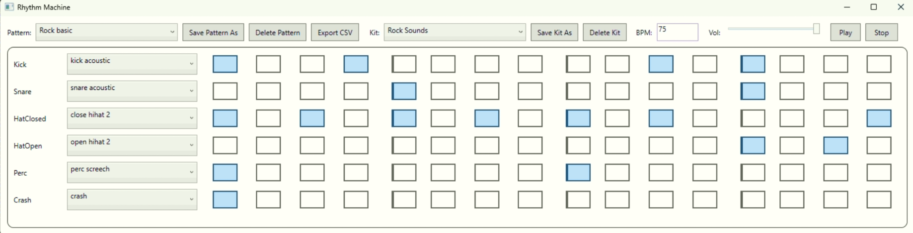

# SEKVENTSER (Rhythm Machine)

16-sammuline WPF step-sekventser kiireks rütmide ja biitide visandamiseks. Rakendus on mõeldud lihtsaks ja otseseks kasutamiseks, mustreid saab muuta reaalajas, ilma playback’i peatamata.



## Enne esimest käivitamist

Enne esmakordset käivitamist tuleb initsialiseerida andmebaas.

Ava projekti juurkaustas terminal ja käivita:
```bash
dotnet ef migrations add UpdateSeedPattern -p App.Infrastructure -s RhythmMachineUI
dotnet ef database update -p App.Infrastructure -s RhythmMachineUI
```

Need käsud loovad SQLite andmebaasi, rakendavad EF Core skeemi ning lisavad algandmed (seed).

Pärast seda käivita projekt RhythmMachineUI.
Rakenduse käivitamisel luuakse automaatselt mitu näidis-mustrit ning imporditakse sisseehitatud helid.

## Funktsionaalsus

- 16 sammu reaalajas muutmine (playback’i ajal saab samme sisse ja välja lülitada)
- Patternid: valimine, kustutamine, salvestamine
- Kitid: valimine, kustutamine, salvestamine
- BPM valideerimine vahemikus 40–240
- helitugevuse reguleerimine (võimaldab muuta esituse valjust)
- CSV eksport aktiivse mustri seisust (“Export CSV”)
  - fail salvestatakse Desktopile nimega <PatternName>.csv
- kui playback on peatatud, siis sammu muutmine mängib vastava heli
- uute helide lisamine: kui paigutada helifailid UI-kihi (Assets/Sounds) kausta, imporditakse need rakenduse käivitamisel automaatselt andmebaasi (vajadusel tuleb migreerimised uuesti luua)

## Kuidas kasutada sammusekvenserit

Sammusekvenser töötab vasakult paremale liikuvate sammudega, kus iga samm määrab, kas heli mängitakse või mitte. Playback’i käivitamisel liigub aktiivne samm üle 16 sammu ning sisse lülitatud sammud mängivad valitud kiti heli. Samme saab sisse ja välja lülitada ka esituse ajal, mis võimaldab rütmi reaalajas muuta. BPM määrab tempo ning pattern’eid ja kit’e saab valida ning salvestada, et luua ja taaskasutada erinevaid rütme.

## Andmemudel 

Projekt on jaotatud DDD kihtideks:
- RhythmMachineUI – WPF UI, MVVM, Dependency Injection
- App.Application – rakendusteenused ja use-case’id
- App.Domain – entiteedid ja domeenireeglid
- App.Infrastructure – EF Core, migratsioonid, import/eksport

Aggregate Root’id:
- Pattern (sisaldab PatternStep-e)
- Kit (sisaldab KitSlot-e)

Pärilus (TPH):
- SoundBase → BuiltInSound, UserSound
- EF Core kasutab Discriminator veergu tabelis Sounds.
- valitud on TPH, kuna see on lihtsam ja jõudluselt sobiv lahendus antud pärilushierarhia jaoks.

Unikaalsus (andmebaasi indeksid):
- Pattern.Code on unikaalne
- Kit.Name on unikaalne
- KitSlot (KitId, Role) on unikaalne
- PatternStep (PatternId, Role, StepIndex) on unikaalne

Seed-andmed:
- andmebaasi luuakse mitu mustrit koos 16-sammulise step
- andmestikuga, et rakendust saaks kohe kasutada.

## Domeenireeglid 

- BPM peab olema vahemikus 40–240 (Pattern.SetBpm)
- Locked staatusega mustrit ei saa muuta (Pattern.Toggle, Pattern.SetStatus)
- Ready staatuse jaoks peab mustris olema vähemalt üks aktiivne samm (Pattern.SetStatus)
